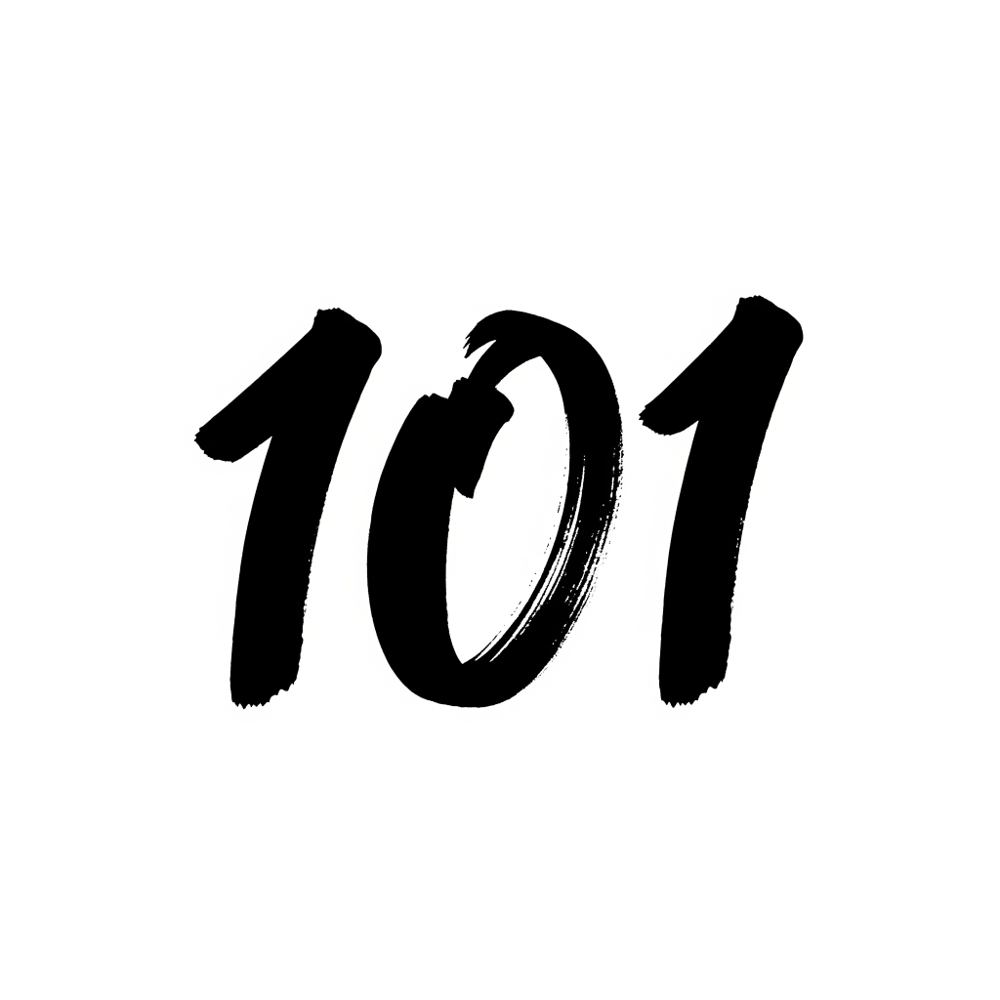

# Zen

A calm, focused reader for 101 Zen stories. Browse the full collection, search by title or text, continue where you left off, and keep favorites for quick return.

**Features**
- Story library with full-text search.
- Continue reading and progress indicator.
- Favorites list with a dedicated empty state.
- Random story jump from the title.
- Light, dark, and auto themes.
- English, Ukrainian, and Russian localization.

**Run Locally**
1. Install dependencies: `npm install`
2. Start the app: `npx expo start`

**Publish (iOS + Android)**
- Fill in app identifiers + legal links in `app.json`, then validate: `npm run release:check`
- Install EAS CLI if needed: `npm i -g eas-cli`
- Build with EAS:
  - Android: `npm run build:android`
  - iOS: `npm run build:ios`
- Submit with EAS:
  - Android: `npm run submit:android`
  - iOS: `npm run submit:ios`

See `store/RELEASE_CHECKLIST.md` for the full release checklist.
